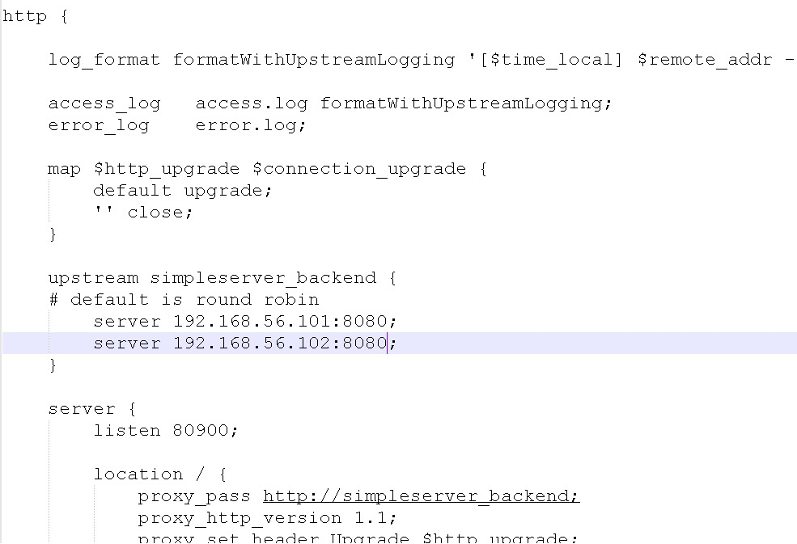
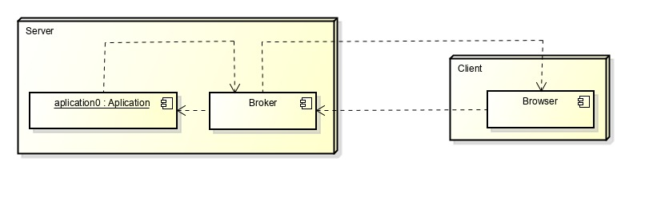
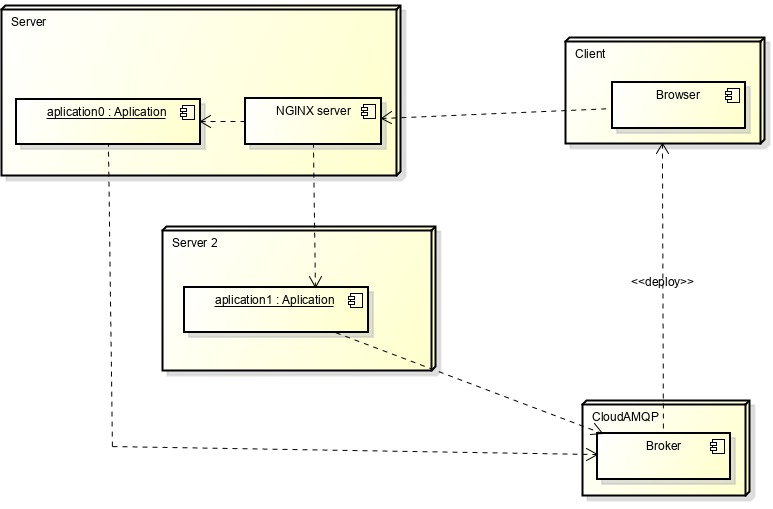

# Lab 10 ARSW

Initially, the pertinent configurations were made to the virtual machines so that they would be able to connect to the Internet correctly.

## Parte l
- First the ActiveMQ server was activated and tested and the collaborative polygon creation laboratory was used. It was modified so that instead of using a message broker embedded in the application, it would delegate event management to ActiveMQ (which is a dedicated messaging server).

- Subsequently, the application was installed on both machines and the correct operation of the topics was checked, the verification was done through the Web console of ActiveMQ.

## Part ll
In this part we use the virtual machines that we had previously prepared.

Then configure the file nginx to use a load balancer machine, check its proper functioning, and then moved the file.conf to the files that were included by default in the activation of nginx and so we would not have burned files.

## Part lll

## Part lV

The design used is presented below:

## Question - Which one is better?
In terms of an opinion forum (https://stackshare.io/stackups/activemq-vs-kafka-vs-rabbitmq), the votes are as follows:

Why do developers choose ActiveMQ?

- 8  Open source
- 8 Efficient    
- 7 Easy to use    
- 2 JMS compliant    
- 1 Support XA (distributed transactions)    
- 1 Distributed Network of brokers    
- 1 High Availability    
- 1 Persistence
- 1 Scalable

Why do developers choose RabbitMQ?

- 203  It's fast and it works with good metrics/monitoring    
- 71 Ease of configuration    
- 48 I like the admin interface    
- 43 Easy to set-up and start with    
- 15 Standard protocols    
- 14 Intuitive work through python    
- 14 Durable
- 8 Written primarily in Erlang    
- 5 Completeness of messaging patterns    
- 5 Simply superb

So we agreed with the majority that we would prefer RabbitMQ to ActiveMQ.
